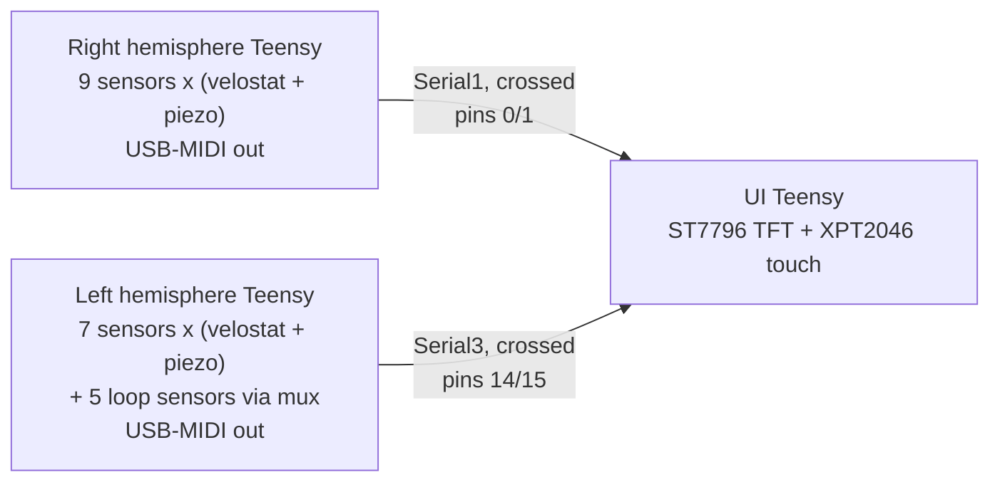

# jaiba-kicad-control

KiCad project for the Jaiba hexa-drum's control board: three Teensy 4.1s in
sockets — one per hemisphere plus one for the UI — with a velostat **and** a
piezo front-end for every drum sensor, plus five loop-control sensors.

## System overview



Every sensor Teensy sends MIDI straight to the host over its own USB port; the
UART links carry calibration commands and live monitoring only. Each sensor
Teensy is a separate USB-MIDI device and the host merges them.

## The 18-analog-input ceiling

This is the constraint the whole layout follows.

A Teensy 4.1 has exactly **18 analog inputs**, and it is a hardware limit, not a
software one: the i.MX RT1062 has 18 ADC-capable pads and Teensy 4.1 breaks all
of them out. Pins 28–37 are *not* analog — the core's `pin_to_channel[]` table
returns `255` for them, and `analogRead()` returns 0.

```
A0  A1  A2  A3  A4  A5  A6  A7  A8  A9  A10 A11 A12 A13 A14 A15 A16 A17
14  15  16  17  18  19  20  21  22  23  24  25  26  27  38  39  40  41
```

Each drum sensor needs **two** analog inputs — one for its velostat layer, one
for its piezo layer — so:

| Board | Sensors | Analog pins | Spare |
|---|---|---|---|
| Right hemisphere | 9 dual-layer | 18/18 | 0 |
| Left hemisphere | 7 dual-layer + 5 loop | 15/18 | 3 |
| UI Teensy | — | 0/18 | 16 |
| **Total** | **16 dual-layer + 5 loop = 21** | | |

The five loop sensors cannot fit alongside the hemisphere sensors: 16 dual-layer
sensors already consume 32 of the two sensor Teensys' 36 analog pins, and the
left Teensy has only **4** spare — one short of five.

So the loop sensors are wired **velostat-only** (they need one pin each, not
two, because nothing needs their attack velocity) and **share a single ADC pin
through a CD74HC4067 16:1 multiplexer** on the left Teensy: `C0`–`C4` are the
loop sensors, `SIG` goes to one analog pin, `S0`–`S3` to four digital pins, and
`EN` is tied to ground so the mux is always enabled. That leaves **11 mux
channels free** for future pads.

**This costs the percussive pads nothing.** The mux is never in their signal
path — they keep dedicated ADC pins — and because the loop sensors leave the
percussive scan entirely, the fast loop actually gets *shorter* (7 pads instead
of the 9 that two dual-layer loop sensors would have made). The loop sensors can
be read on a slow `millis()` cadence since velostat control does not need a
high sample rate.

### Two more things that shape the layout

**The analog pins are lopsided across the two rows.** Fourteen of the eighteen
sit on ROW1 (pins 14–23 and 38–41); only four (24–27) are on ROW2. That is why
each sensor Teensy's 7 ROW1-only sensors are the ones that get dedicated pins,
and why the loop sensors (which need one pin each, not two) were the ones moved
behind the mux.

**Two ADCs.** Pins 26/27 (A12/A13) and 38/39 (A14/A15) are ADC2-only; the other
fourteen are ADC1. `analogRead()` handles the switching transparently, but it
matters if you ever want simultaneous sampling.

## Floorplan

The drum pad cables arrive at the **right-hand edge** of the board, and the three
Teensys' USB sockets point **left**, so the board splits into two regions:

```
   +----------------------------------------------------------+
   |  U_R  [buttons]                       colA         colB  |
   |  U_L  [buttons]   U_MUX             ||    ||      ||   || |
   |  U_UI [TFT]                         ||    ||      ||   || |
   |                                   (8 dual + 3    (8 dual +|
   |                                    loop rows)    2 loops) |
   +----------------------------------------------------------+
```

* **Left** — the three Teensys stacked vertically with their USB sockets facing
  left, each sensor Teensy with its cal/curve buttons below it, plus the mux and
  the TFT header.
* **Right** — every sensor connector, in **two columns of cells whose connectors
  face outward**: 21 connectors at x = 120 mm (11 of them) and x = 152 mm (10).
  The aisle between the columns is what lets a cable reach the inner one.
* **Buses** run vertically at x = 92 mm (3V3) and x = 100 mm (GND), between the
  two regions, where they clear every courtyard on both sides.

A cell's connector sits on the **right** of the cell, which is why
`sensor_cell(..., mirrored=True)` exists: it is a true mirror of the left-facing
variant about the cell's centre line, and mirroring is what keeps the internal
routing crossing-free.

**What this costs.** Gathering the connectors here makes each cell's two runs to
its Teensy long jumpers — roughly 30–130 mm instead of the ~15 mm they were when
the cells sat directly above ROW1. They are wire jumpers either way on a
single-sided board, but it is the main trade of this arrangement: the piezo ADC
node (about 5 kΩ source impedance) now travels the length of the board. If that
shows up as noise on the piezo channels, the fix is to keep the piezo front end
by the Teensy and move only the connector out to the edge.

## Board geometry

* **168 × 240 mm**, two copper layers in KiCad's stackup. (Was 160 wide; the
drum solder pads pushed the second column past the edge by 0.15 mm.)
* Rows are **15.24 mm apart** (0.6"), pin span 58.42 mm, board 60.96 × 17.78 mm.
  (0.7" is the *board width*, not the row pitch — an earlier revision used
  17.78 mm as `ROW_GAP` and the sockets could not line up with a real Teensy.)
* Mounting holes at 6 mm in from each corner.

## Sensor front-ends

Each sensor is one 4-pin connector (`3V3`, `VELO`, `PIEZO`, `GND`) plus its
divider parts, so a hemisphere's nine sensors are nine identical cells:

**Velostat layer** — the sheet is the top leg, the board's 100 Ω is the bottom:

```
3V3 ── velostat ──┬── VELO  (ADC pin)
                  │
                 100Ω
                  │
                 GND
```

**Piezo layer** — 10k/10k attenuator with a clamp diode:

```
PIEZO ── R1 (10k) ──┬── PSIG  (ADC pin)
                    │
                   R2 (10k)          1N4148
                    │                 │
                   GND      anode ────┴──── cathode → 3V3
```

The diode's **anode** faces the ADC node and its **cathode** faces 3.3 V. Note
that KiCad's `D_DO-35_SOD27_P7.62mm_Horizontal` numbers pad 1 as the *cathode*
— the earlier revision of this board had pad 1 on the ADC node, which
forward-biases the diode for any signal below ~2.6 V and clamps the piezo node
flat instead of protecting it.

## Pin tables (verified)

Read off a real Teensy 4.1, then cross-checked against a published Teensy 4.1
footprint and symbol pair (the two agree exactly). Index 0 is the end nearest
the USB connector.

```
ROW1: 5V, GND, 3V3, 23, 22, 21, 20, 19, 18, 17, 16, 15, 14, 13, GND, 41, 40, 39, 38, 37, 36, 35, 34, 33
ROW2: GND, 0, 1, 2, 3, 4, 5, 6, 7, 8, 9, 10, 11, 12, 3V3, 24, 25, 26, 27, 28, 29, 30, 31, 32
```

The 5 V pin is the pin PJRC calls VIN; there is no VIN pad in either main row.

## Board geometry

* **168 × 240 mm**, two copper layers in KiCad's stackup. (Was 160 wide; the
drum solder pads pushed the second column past the edge by 0.15 mm.)
* Rows are **15.24 mm apart** (0.6"), pin span 58.42 mm, board 60.96 × 17.78 mm.
  (0.7" is the *board width*, not the row pitch — an earlier revision used
  17.78 mm as `ROW_GAP` and the sockets could not line up with a real Teensy.)
* Power buses run the full height at x = 92 mm (3V3) and x = 100 mm (GND).
* Mounting holes at 6 mm in from each corner.

### Copper sizes for home etching

This board is hand-etched — no solder mask, no plated barrels — so the copper is
deliberately far fatter than a fab would ask for. Three constants in
`jaiba_board_layout.py` drive it, and all three footprint generators read them,
so changing them keeps the library and the board in step:

```python
TRACK_W = 0.8          # signal
BUS_W   = 1.0          # power bus bar
PAD_DIA = 2.2          # every plated through-hole pad
```

What that produces on the finished board:

| feature | size |
|---|---|
| pad diameter, all plated pads | 2.2 mm |
| track width | 0.8 mm signal, 1.0 mm bus |
| **narrowest gap, pad to pad** | **0.34 mm** |
| narrowest gap, track to pad | 1.04 mm |
| narrowest gap, track to track | 1.74 mm |
| smallest annular ring | 0.55 mm |
| mounting holes | 3.2 mm NPTH, unplated (unchanged) |

**The 0.34 mm pad-to-pad gap is the etch limit.** It is not a one-off: it occurs
at every adjacent pair on every 2.54 mm header, which is most of the board. Two
2.2 mm pads on a 2.54 mm grid leave 2.54 − 2.2 = 0.34 mm, and at that pitch **no
track can pass between two pads at all** (2.54 − 2.2 − 0.8 < 0) — which is why
the cell routing goes around pads rather than between them.

That gap is comfortable for toner transfer *if* the toner adheres and you do not
over-etch; it is where a home board will bridge first if anything does. If it
does, change `PAD_DIA` and re-run the three footprint generators:

| `PAD_DIA` | pad-to-pad gap |
|---|---|
| 2.2 mm (current) | 0.34 mm |
| 2.0 mm | 0.54 mm |
| 1.8 mm | 0.74 mm |

The board outline and every part position are unaffected — only the pads change.

### Single-sided copper

The physical build is one copper layer, so nothing can cross anything else in
copper. KiCad has no single-layer stackup (it requires an even count, minimum
two), so the board is 2-layer in KiCad and single-sided is a *manufacturing*
decision: only `F.Cu` is fabricated, and everything the plan lists as a jumper
becomes an insulated wire on the component side.

The generator draws only what can never cross: the bus bars, the short
intra-cell links, the five loop-sensor wipers, and the seven TFT/touch signals
that run straight up from their header to the UI Teensy's ROW2. **57 jumper
links remain** — each channel's runs to its analog pin, every cell's 3V3/GND
taps, the buttons, the UART links, TFT SCK, and the mux's own power and signal
runs. Run **Inspect → DRC** to see them as ratsnest.

## Files

| Path | What it is |
|---|---|
| `jaiba_board_layout.py` | **Source of truth.** Pure-Python placement + net plan, no `pcbnew`. |
| `jaiba-kicad-controlboard.py` | Applies the plan via `pcbnew`; run inside KiCad's Scripting Console. |
| `kicad-control-board/jaiba.pretty/` | Project-local footprint library — self-contained, no KiCad system libs. |
| `kicad-control-board/*.kicad_pcb` | Generated board (168 × 240 mm, 278 footprints, 584 pads). |
| `tools/make_library.py` | Rebuilds `jaiba.pretty/` by lifting footprints out of the board. |
| `tools/make_teensy_footprint.py` | Generates `Teensy_4.1.kicad_mod` from PJRC's published dimensions. |
| `tools/emit_board.py` | Writes the `.kicad_pcb` from the plan **without** KiCad. |
| `tools/route_jumpers.py` | Pre-routes the wire jumpers onto B.Cu as a guide (see below). |
| `tools/preview_board.py` | Renders the board to an SVG so a floorplan change can be eyeballed without KiCad. |
| `tools/verify_board.py` | DRC-style geometry checker (plan or emitted board). |
| `tools/kicad_sexpr.py` | S-expression reader/writer, quote-preserving. |

## Regenerating the board

**With KiCad** — open the PCB Editor, open **Tools → Scripting Console**:

```python
exec(open(r'/path/to/jaiba-kicad-controlboard.py').read())
```

**Without KiCad** — the same board straight from the plan:

```bash
python3 tools/emit_board.py            # writes kicad-control-board.kicad_pcb
python3 tools/verify_board.py kicad-control-board/kicad-control-board.kicad_pcb
```

**Full rebuild from scratch** — if `jaiba.pretty/` is ever missing, this
regenerates every footprint before the board. Order matters: the library has to
exist before `emit_board.py` can read it.

```bash
python3 tools/make_library.py           # passives, lifted out of the board
python3 tools/make_teensy_footprint.py  # Teensy 4.1, from PJRC dimensions
python3 tools/make_module_footprint.py  # CD74HC4067 module, from caliper measurements
python3 tools/emit_board.py
python3 tools/route_jumpers.py          # optional: B.Cu jumper guide
python3 tools/verify_board.py kicad-control-board/kicad-control-board.kicad_pcb
```

`verify_board.py` checks that no pad or courtyard leaves the outline, no two
pads overlap, no courtyards collide, and no track breaks clearance from another
net, a pad, or a mounting hole. A clean run prints `RESULT: clean`.

**Footprint library.** `jaiba.pretty/` is committed and self-contained, so
neither route needs KiCad's system libraries or a configured install path.
`make_library.py` only needs re-running if you change the passives; it lifts
their geometry out of a board that KiCad wrote. `make_teensy_footprint.py`
generates the Teensy footprint from PJRC's published dimensions, and
`make_module_footprint.py` generates the mux module footprint from your caliper
measurements — it prints a 1:1 SVG sheet alongside, for checking against the
real board on paper.

**Format version.** The emitted board declares KiCad 9's format
(`20241229`). KiCad 9 and 10 both open it; a newer KiCad will offer to upgrade
it in place. The stackup, design rules and plot parameters in
`tools/emit_board.py`'s `BOARD_TEMPLATE` are captured verbatim from a
KiCad-written board — edit them there rather than by hand in the `.kicad_pcb`,
which is regenerated.

## Drum-cable solder pads

The drum cable takes all the movement, so each of its four lands on its own bare
copper pad rather than only on a 2.2 mm through-hole pad. **74 pads** — four per
dual-layer cell (3V3, VELO, PRAW, GND) and two per loop cell.

They are `SolderPad_1x01`: a **4.0 × 2.0 mm rectangle of exposed copper**
(`F.Cu` + `F.Mask` only — no paste layer, because there is no stencil), sitting
just outboard of each cell's connector and fed by a straight horizontal stub
from its pin. That gives **3.1× the soldering area** per connection, and you can
solder the wire along a 4 mm run of copper instead of onto one small pad.

Two constraints shaped it:

* **They could not go beside the connector in X.** The passives are ~1 mm to its
  left and the cell edge 0.8 mm to its right, so every vertical channel inside
  the cell is blocked. Outboard of the connector is the only clear space — which
  also happens to be the side the drum cable arrives from.
* **2.0 mm tall, not 2.2.** Adjacent pins are 2.54 mm apart; anything taller made
  neighbouring courtyards touch.

Being surface-mount, these add **no holes** — the drill count is unchanged.

The board grew to **168 mm wide** for them: at 160 the second column's pads would
have overhung the edge by 0.15 mm.

## Wire landing pads

Soldering a jumper onto a pin that already holds a socket or a module pin puts
**two joints in one hole** and pours heat into the part. So every end of every
jumper gets a pad of its own, reached by a short F.Cu stub. **100 of them:**

| where | pads | why |
|---|---|---|
| beside the Teensys | 50 | 22 right, 23 left (it also carries the mux lines), 5 UI |
| beside the mux module | 13 | `C0`–`C4`, `SIG`, `S0`–`S3`, `EN`, `VCC`, `GND` |
| in the sensor cells | 32 | `VELO` and `PSIG` for each of the 16 dual-layer sensors |
| in the loop cells | 5 | `VELO` for each |

TFT pins 6–12 have none: they are already drawn in copper to the header.

**Beside the Teensys and the mux** the pads step *diagonally* — each one further
out from the pin row and further along than the last — so the wires comb out
instead of bunching at 2.54 mm pitch. Stubs cannot cross, provably: a stub always
ends left of where the next one starts (`i × 1.15 < 2.54 × (i+1)`). Consecutive
pads land about 3.9 mm apart. The mux's channel inputs fan up and its control
pins fan down, so the module's two rows don't fight for the same space.

**In the sensor cells** the two pads go on the sides their nodes already live on,
because putting both on the right makes the two routes *topologically cross* —
no planar routing can fix that:

```
        R_VELO                                          J_PAD  (3V3 VELO PRAW GND)
   ┌──────────────┐                                        │
   │   ○ VELO     │  <- velostat pad, in the free band      │
   ├──────────────┤     between R_VELO and R1               │
   │   R1    R2   │                                         │
   │              │                                         │
   │   D          │  ○ PSIG  <- piezo pad, crossed on y=18.5 │
   └──────────────┘
```

The cal/curve buttons moved to the right-hand side of each Teensy for this: their
pads were landing *inside* the switches. Being off to the side also puts them
somewhere a finger can reach.

The B.Cu jumper guide aims at these pads rather than at component leads, which is
where the wire physically goes.

## The B.Cu jumper guide

The board is single-sided, so the ~60 connections the generator leaves unrouted
become insulated wire jumpers on the component side. KiCad draws those as
straight ratsnest lines, which at this count is an unreadable spider web.

`tools/route_jumpers.py` lays a plausible *path* for each one on **B.Cu**. That
layer is not fabricated, so it is free to use as a map, and it is a faithful
model:

* every jumper ends on a through-hole pad, and THT pads exist on all copper
  layers, so **no vias are ever needed**;
* a B.Cu track cannot clash with the F.Cu copper — which is exactly right, since
  the real wires are insulated and cross traces freely;
* B.Cu coordinates map 1:1 onto the component side, so what you see in the normal
  top view is where the wire physically goes.

Routes are orthogonal paths on a 0.635 mm lattice, avoiding pads of other nets,
mounting holes and the board edge. **They are allowed to cross each other** —
forbidding that is not a real constraint for insulated wire, and enforcing it
strangled the few corridors into the Teensys. So the guide contains many
crossings on purpose.

> **When plotting for etching, select `F.Cu` only.** B.Cu now contains copper and
> must never be made. `kicad-cli pcb export gerbers` would export both.

The verifier knows about layers: it checks F.Cu strictly, and reports B.Cu
crossings as a count rather than as shorts. KiCad's own DRC will flag them —
exclude B.Cu, or just remember what that layer is.

## A note on file formatting

`emit_board.py` refuses to write a board whose quoting KiCad would reject. The
specific trap: KiCad's parser accepts a bare *symbol* almost anywhere — unquoted
`(layer F.Cu)` and bare uuids load fine — but a value that tokenises as a
**number** where it wants a symbol is fatal. `(generator_version 9.0)` produces
exactly one error, naming a line number and nothing else:

```
Expecting 'symbol' in '...kicad-control-board.kicad_pcb', line 27117, offset 22
```

The lint walks the tree before writing and reports the path to any such value,
so this surfaces as a build error instead of a KiCad load failure.

Worth knowing: `make_library.py` lifts the passive footprints **out of the
generated board**, so its formatting style feeds back into the library and then
into the next generation. That is self-correcting now that the emitter writes
canonically, but if the board file is ever hand-edited into a non-canonical
style, re-running the chain will propagate it.

## Open items

- [ ] **Firmware split.** `SensorFirmware_Arduino.ino` still runs 6 velostat
      (A0–A5) + 6 piezo (A6–A11) on a *single* sensor Teensy. This board has two
      hemisphere Teensys — 9 dual-layer sensors on the right, 7 on the left —
      so the sensor firmware needs a per-hemisphere variant (or a board-ID
      offset).
- [ ] **Loop-sensor firmware.** The left Teensy now drives the CD74HC4067's
      four select lines and reads `SIG`; the loop pads are velostat-only, so the
      per-pad piezo path (`analogRead(s.piezoPin)`, and `piezoPins[]` at setup)
      needs a "this pad has no piezo" guard. Read them on a slow `millis()`
      cadence, not in the percussive scan.
- [ ] **UI firmware only reads `Serial1`.** `Serial3` appears nowhere in either
      firmware, so the left-hemisphere link is dead copper until the UI reads
      it and merges two sensor streams.
- [ ] **Verify the module footprint before ordering.** `CD74HC4067_Module`
      is generated from caliper measurements; the two pin spans were confirmed
      at exactly 38.10 mm and 17.78 mm, but `row_spacing` (14.9 mm measured, vs
      the 15.24 mm 0.1″-grid value) is still unconfirmed. Print
      `jaiba.pretty/CD74HC4067_Module_1to1_printfix.svg` at 100%, check the
      50 mm bar, then lay the module on it. Fixing it is one constant in
      `tools/make_module_footprint.py`; the board outline is unaffected.
- [ ] **There is no schematic.** `kicad-control-board.kicad_sch` is empty, so
      nets exist only in the PCB, there is no ERC, and "Update PCB from
      Schematic" would wipe the design.
- [ ] **Reconsider single-sided.** 37 analog channels plus the mux is a lot of
      wire jumpers; a normal 2-layer fab would route nearly all of them in
      copper.
- [ ] Confirm the Teensy footprint's row assignment (ROW1 at y = −7.62) against
      a real Teensy in KiCad's footprint viewer before ordering.
