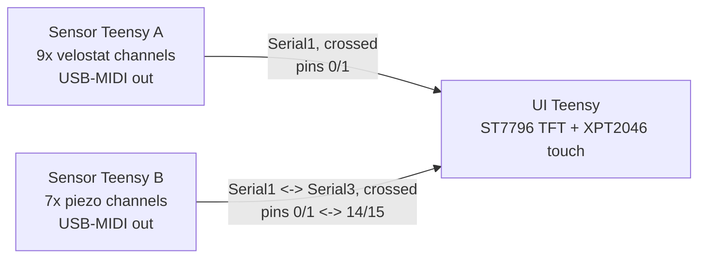

# jaiba-kicad-control

KiCad pcbnew scripts for the Jaiba hexa-drum's electronics: a single "master
board" that carries three Teensy 4.1s (in sockets) — two sensor controllers
and one UI controller — plus the sensor divider circuits, cal/curve buttons,
and a TFT+touch header.

## System overview



Each sensor Teensy sends MIDI straight to the host over its own USB port —
the UART links are only for calibration commands and live monitoring data,
not the musical output. The UI Teensy reads both links to drive the TFT and
forward tuning commands back.

| Board | Role | Analog channels | Own USB port |
|---|---|---|---|
| Sensor Teensy A | Velostat sensing | A0–A8 (9x, physical pins 14–22) | Yes — MIDI + serial console |
| Sensor Teensy B | Piezo sensing | A0–A6 (7x, physical pins 14–20) | Yes — MIDI + serial console |
| UI Teensy | Display + calibration control | — | Yes — programming/serial console only |

## Board is single-sided copper

This board has **one copper layer**. Nothing can cross anything else in
copper — no vias, no routing under a row of pads. Every connection below
marked "not auto-routed" needs an actual **insulated wire jumper** soldered
on the component side, not a hand-drawn PCB trace. The generator script sets
the board to 1 copper layer so KiCad's DRC enforces this instead of
assuming a back layer is available.

## Inter-board connections

### Power

3.3V and GND run as bus bars down the left (x=3mm) and right (x=147mm)
edges of the board. Every Teensy's GND/3.3V pins, and every sensor channel's
GND/3.3V pins, tie into these — as jumpers, per the single-layer note above.
VIN/5V is left unconnected; how the board is powered (USB vs. a separate
supply into VIN) is a build-time choice, not something baked into the layout.

### UART links

Two independent, crossed serial links — no shared bus, each sensor Teensy
gets the UI Teensy's full attention on its own hardware UART:

| Signal | Sensor Teensy pin | UI Teensy pin | UI hardware serial |
|---|---|---|---|
| Sensor A TX1 → UI RX1 | A: pin 1 | UI: pin 0 | `Serial1` |
| Sensor A RX1 ← UI TX1 | A: pin 0 | UI: pin 1 | `Serial1` |
| Sensor B TX1 → UI RX3 | B: pin 1 | UI: pin 15 | `Serial3` |
| Sensor B RX1 ← UI TX3 | B: pin 0 | UI: pin 14 | `Serial3` |

Both links run 115200 baud, GND shared via the common bus.

> **Firmware note:** `UIFirmware_Arduino.ino` currently only reads
> `Serial1`, wired for a single sensor Teensy. This board's `Serial3` link
> to Sensor Teensy B is wired in copper but needs a small firmware addition
> to actually be read — not yet implemented.

### Sensor channel wiring

Both sensor circuits are voltage dividers feeding a Teensy analog pin,
matching the sensor firmware's expected wiring exactly.

**Velostat channel** (x9 on Sensor Teensy A):

```
3.3V ── velostat ──┬── ADC pin (A0–A8)
                    │
                   100Ω
                    │
                   GND
```

**Piezo channel** (x7 on Sensor Teensy B):

```
piezo+ ── R1 (10k) ──┬── ADC pin (A0–A6)
                      │
                     R2 (10k)          1N4148
                      │                 │
                     GND      anode ────┴──── cathode → 3.3V
piezo- ── GND                (clamps the ADC node to 3.3V)
```

### TFT + touch header

8 signal pins plus a 2-pin power tap, matching an ST7796 display sharing its
SPI bus with an XPT2046 touch controller:

| Function | UI Teensy pin | Row |
|---|---|---|
| SCK | 13 | ROW1 |
| MISO | 12 | ROW2 |
| MOSI | 11 | ROW2 |
| Display CS | 10 | ROW2 |
| RST | 9 | ROW2 |
| DC | 8 | ROW2 |
| Touch IRQ (unused) | 7 | ROW2 |
| Touch CS | 6 | ROW2 |

SCK is the odd one out on ROW1 — everything else on this header shares
ROW2, which is why the generator script can auto-route 7 of the 8 pins and
leaves SCK as a jumper.

### Cal / curve buttons

Each sensor Teensy gets 2 buttons, wired `INPUT_PULLUP` style (pin to GND
through the switch):

| Button | Sensor Teensy pin | Row |
|---|---|---|
| Calibration | 3 | ROW2 |
| Curve preset cycle | 4 | ROW2 |

## Teensy 4.1 pin tables (photo-verified)

The generator script encodes the physical pin order of each row, read off
an actual Teensy 4.1 board rather than the datasheet. Index 0 is the end
nearest the USB connector on each row:

```
ROW1: 5V, GND, 3V3, 23, 22, 21, 20, 19, 18, 17, 16, 15, 14, 13, GND, 41, 40, 39, 38, 37, 36, 35, 34, 33
ROW2: GND, 0, 1, 2, 3, 4, 5, 6, 7, 8, 9, 10, 11, 12, 3V3, 24, 25, 26, 27, 28, 29, 30, 31, 32
```

Worth a final glance against
[pjrc.com/teensy/pinout.html](https://www.pjrc.com/teensy/pinout.html)
before ordering boards — if anything's off, the fix is editing these two
lists in the script and re-running; nothing else depends on the specific
values, only on internal consistency.

## Running the generator

1. Open KiCad's PCB Editor and start a new (or cleared) board.
2. Open **Tools → Scripting Console** from that same window.
3. `exec(open(r'path\to\master_board_kicad_script.py').read())`
4. Run **Inspect → DRC**. The ratsnest lines it reports are exactly the
   jumper-wire connections listed above.

## Repo contents

- `master_board_kicad_script.py` — generates the 3-Teensy master board.
- (sensor board scripts / firmware references — add as the repo grows)

## Open items

- [ ] Add `Serial3` handling to `UIFirmware_Arduino.ino` for the Sensor B link.
- [ ] Route/jumper the connections listed as "not auto-routed" above.
- [ ] Confirm the Teensy 4.1 pin tables against the official pinout before ordering boards.
